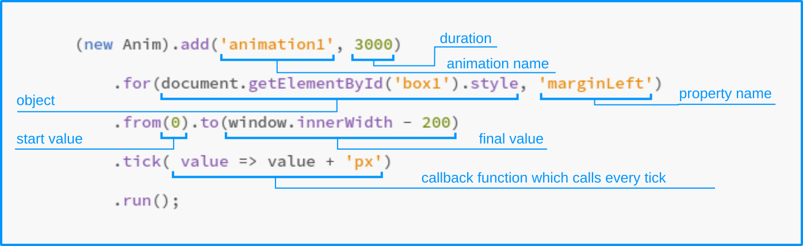

Anim.js
==============

This is a little tool(~1.6KiB) designed to animate any JS object. The basic concept is one animation for one property of an object. Any numerical property can be tied to a function and change over time. You can also create many separate animations of the same object.




[Example](https://drgoshm.github.io/anim.js/Anim_test)

Of course CSS animation better then JS, but I guess this tool will help somebody who tries animate drawing on HTML5 canvas.

### How to use

1. First of all, need to create new Anim object

```javascript
const anim = new Anim(); 
```

2. Create new animation

```javascript
anim.add('animationName', 3000)
```
Method `add(...)` requires two arguments:
The first is a string - animation name. It is preferable to use the Camel-case format because you can access to animation object by name as a property of the base object:

```javascript
anim.animationName
//or
anim['animationName']
```
The second argument is the total animation time in milliseconds.


Method `add(...)` returns a special object which provides some methods for extending the animation: `for(...)`, `from(...)`, `to(...)`, `tick(...)`, `after(...)`, `timing(...)` and `run()`.
All these methods return the same special object, that allows making a calling chain.

```javascript
anim.add('animationName', 3000).for(someObject, 'propertyNameAsString')
```

Method `for(...)` binds animation action to a property of an object.


```javascript
anim.add('animationName', 3000).from(fromValue).to(toValue)
```

Methods `from(...)` and `to(...)` set start and final values. You may not set a binding to the property of an object using `for(...)`. In this case, the animation will work independently of this and calculate the intermediate values that will be passed to the callback function.


```javascript
anim.add('animationName', 3000).tick(function(value){ return value })
```

Method `tick(...)` has one argument a callback function which will call every time in during animation loop.  
Callback function also has one argument the intermediate value. The callback function can return the modified value.


```javascript
anim.add('animationName', 3000).timing('bounce', 'out')
```

The first argument of method `timing(...)` requires a name of one of some timing functions which included in the base object: 
* `'linear'` - default linear timing function. Change of values occurs linearly.
* `'circ'` - The change in value occurs smoothly along the arc. 
* `'bounce'` - The change in value occurs trajectory of a dropped ball.
* `'elastic'`  - The change in value like a damped pendulum.
Also, you can use a callback function instead of the name of the timing function. That function must receive the linear value and returns a modified value as you wish.


The second optional argument is a direct application. It must be one of these values:
* `'in'` - default value. It means that the timing function will use in forwarding direction.
* `'out'` - The timing function will use in a backward direction.
* `'both'` - The timing function will use in both directions.

```javascript
anim.add('animationName', 3000).run();
```

And the final method of the calling chain is `run()`. It starting the animation. Calling that method is optional. 
Created animation can be running by own method of animation object in other time.

```javascript
anim.animationName.run();
```


3. Animation loop

The base object has two methods for organizing the global animation loop.

```javascript
anim.update(Date.now());
```

This method may be called in the event loop of your app. Requires one argument a current time in milliseconds.

```javascript
anim.loop();
```
Create own event loop which tries to run `update(t)` every 16.6(6) ms.


